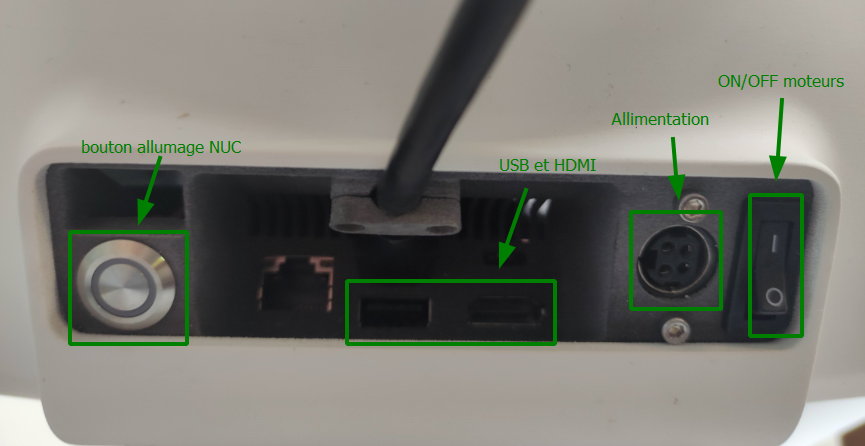
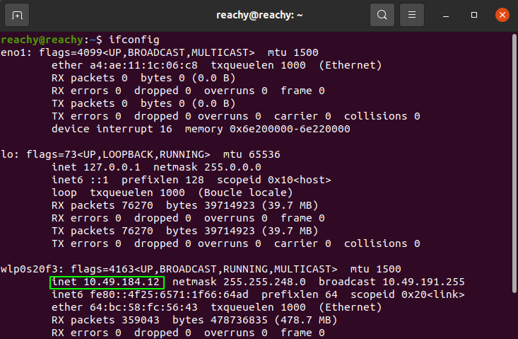

| Classe de capsule  | &emsp; durée recommandée |
|:-------------------|:------------------|
| Setup  &emsp;  🛠️  |&emsp; 10 min      |


## 📗 Ressources

Plus d'informations sur le robot et sa mise en route avec ces liens :  
- [Doc Pollen Robotics](https://pollen-robotics.github.io/reachy-2019-docs/docs/getting-started/)  (en anglais)
- [Prise en main Reachy](https://github.com/ta18/Reachy_Nautilus/blob/main/Prise%20en%20main.md)

Matériel nécessaire : 
- Hub USB 
- Ecran PC
- Câble HDMI
- Clavier 
- Souris 

💻 : Procédure exécuter sur votre poste de travail    
🤖 : Procédure à exécuter sur le robot


## 1. Premiere mise en route 

1. Branche l'alimentation fournie sur la prise ronde au dos du robot.
2. Branche l'écran en HDMI sur le robot
3. Branche le Hub USB au robot pour connecter le clavier et l'écran.
4. Appuie sur le bouton poussoir à gauche pour mettre sous tension le NUC et sur le bouton ON/OFF à droite pour mettre sous tension les moteurs.
5. Allume l'écran du Reachy. 
6. 🤖 Connecte-toi à la session Reachy, mot de passe *reachy*. 
7. 🤖 Connecte le robot au wifi (partage de connexion via smartphone ou wifi privé)



## 2. Connexion au robot

Le robot Reachy est livré avec une carte NUC (mini ordinateur) qui permet de contrôler les moteurs et les périphériques qui l'équipent.<br>
Pour programmer le robot il y a 2 solutions : 
* **En SSH :** Utiliser son ordinateur personnel et se connecter en SSH au robot 
* **En direct :** Se brancher directement sur le mini ordinateur NUC à l'aide d'un écran, d'un clavier et d'une souris. 

Dans les deux cas il n'y a aucun logiciel particulier à installer. 

### 2.1 Connexion au robot via SSH 📶
 
1. 💻 Connecte l'ordinateur avec lesquel tu veux commander Reachy au même wifi que le robot (cf étape 7. de la section 1.) 
*Exemple* : je connecte le robot au wifi *Maison*. Je connecte mon ordinateur portable au wifi *Maison*.
2. 💻 Connecter son ordinateur au robot via SSH : 
`ssh reachy@adresseIP`
mot de passe : reachy 
3. 💻 Lancer jupyter notebook 

**Si cela ne fonctionne pas...** 


**Trouver l'adresse IP**  
🤖 Pour trouver l'adresse IP de reachy tu peux taper la commande suivante sur un terminal du robot : `ifconfig`  
  
l'adresse IP est encadré en vert sur l'image ci-dessus. 

Vérifie que tu es bien connecté au robot en tapant dans un terminal ou une fenêtre de commande :

```bash
ping 192.168.4.1
```
s'il n'y a pas d'erreur c'est que tu es bien connecté au du robot.

✅ Fait attention à toujours bien rester connecté au même wifi que le robot. 


### 2.2 Connexion au robot en direct 

Une fois les étapes de mise en route effectué (*cf section 1.*), il te faudra rentrer le mot de passe de la session reachy. Mot de passe session : *reachy*. 
Une fois le mot de passe rentré, tu vas te retrouver sur le bureau graphique Linux Ubuntu de robot : 
 

Pour commencer à programmer Reachy il te faut lancer Jupyter Notebook avec les commandes :    
```bash
cd ~/Reachy_Nautilus
jupyter notebook 
```

Et voilà tu es connecté au robot Reachy, bravo ! 🎉