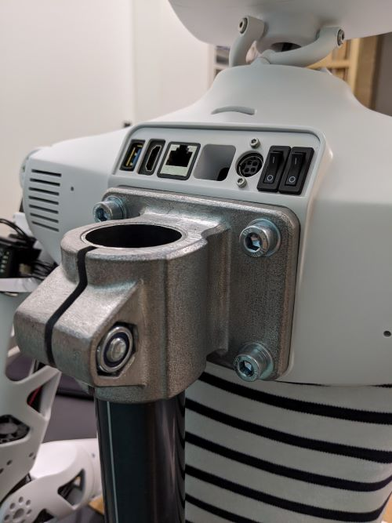

### **
Capsule setup 🛠️
**
### 
Durée : 10min

## 🎒 Prérequis

- Lycée et +

## 📗 Documentation

Si tu souhaites d'autres informations sur le robot et sa mis en route tu peux consulter ces liens :  
- [Doc Pollen Robotics](https://pollen-robotics.github.io/reachy-2019-docs/docs/getting-started/)  
- [Prise en main Reachy](https://github.com/ta18/Reachy_Nautilus/blob/main/Prise%20en%20main.md)

  
### **Infos robot 🤖** : 
Nom du robot: **Nemo**  
Adresse IP : `192.168.4.1` 

## 1. Matériel et branchement

Pour faire fonctionner Nemo, tu dois brancher l'alimentation t'est fournit, au dos du robot (prise ronde) :

Une fois branché, pousse les 2 boutons ON/OFF à droite des prises. Ces boutons servent à mettre sous tension les moteurs et la Raspberry Pi du robot.

## 2. Connexion au robot

### 2.1 Logiciel et installation

Le robot est livré avec une Rasberry Pi qui permet de le controller.
Pour programmer les mouvements de Nemo il te faut juste un ordinateur (sous Windows, Linux ou bien même un Mac) sans rien à installer de particulier. 

### 2.2 Se connecter au serveur en wifi 📶

Pour pouvoir te connecter au Reachy il faut suivre la procédure suivante :

1. Se connecter au hotspot Nemo
2. Entrer l'adresse http://192.168.4.1:8888/ dans un navigateur web
3. Appuyer sur *se connecter* sans rentrer de mot de passe 

**Si cela ne fonctionne pas :** 
✅ Pour vérifier que tu es bien connecté au hotspot du Reachy, tu peux pinger son adresse IP :
`ping 192.168.4.1` sur un terminal de commande. S'il n'y a pas d'erreur c'est que tu es bien connecté au bon appareil.
Fait attention a toujours bien être connecté au hotspot Nemo. 

Et voilà tu es connecté au Reachy ! 🎉
